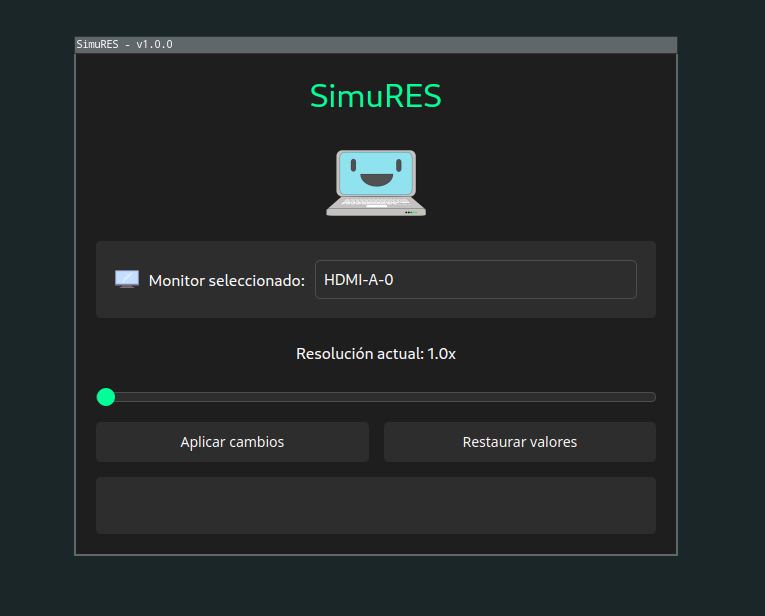
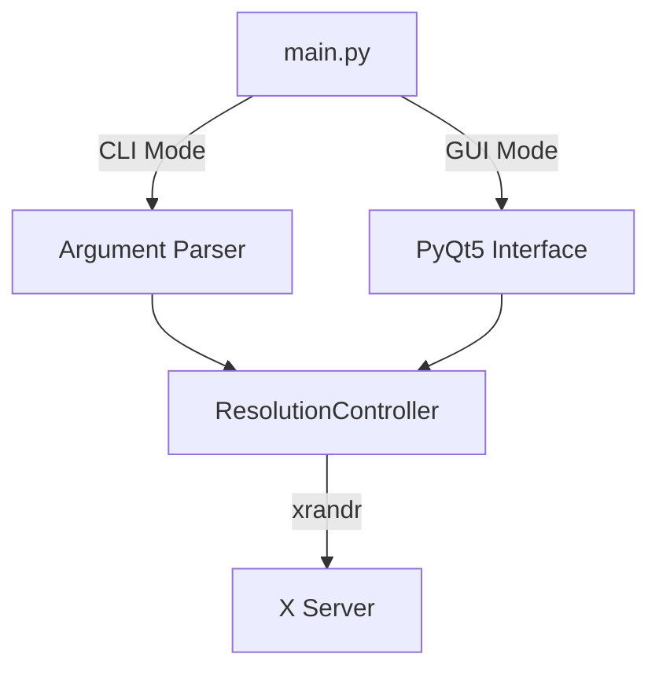

# SimuRES - Simulador de Resolución


*Desarrollado por Rodolfo Casan*

## Descripción
Herramienta multiplataforma (Linux) para modificar y simular resoluciones de pantalla mediante escalado, con interfaz gráfica y línea de comandos. Ideal para:
- Desarrolladores que necesitan probar interfaces en diferentes resoluciones
- Usuarios que requieren ajustes temporales de escalado
- Proyectos de demostración con requisitos específicos de visualización

## Características principales
- **Modo GUI intuitivo**
  - Selector de pantallas múltiples
  - Slider de precisión (1.0x - 20.0x)
  - Indicadores visuales de estado
  - Restauración automática al cerrar
  - Sistema de notificaciones integrado

- **CLI potente**
  - Cambios rápidos desde terminal
  - Integración con scripts
  - Ideal para uso remoto/SSH

- **Seguridad**
  - Manejo robusto de señales (SIGINT, SIGTERM)
  - Restauración de resolución en fallos
  - Validación de parámetros estricta


## Clonar repositorio
```bash
git clone https://github.com/rodolfocasan/simures.git
cd simures
```


## Instalación de dependencias
```bash
# Dependencias de sistema (Linux)
awk '{print $1}' DOCs/debian_requirements.txt | xargs sudo apt-get install -y

# Entorno virtual recomendado
python3 -m venv simures-env
source simures-env/bin/activate
pip3 cache purge && pip3 install -r DOCs/requirements.txt
```

## Uso 🖥️

### Modo Interfaz Gráfica
```bash
python main.py
```




### Modo Línea de Comandos
**Aplicar escalado:**  
```bash
python main.py --start 1.5                 # Escala 1.5x en monitor principal
python main.py --start 1.8 --output HDMI-1 # Escala 1.8x un monitor específico
```

**Restaurar resolución:**  
```bash
python main.py --stop                       # Restaura monitor principal
python main.py --stop --output DP-1         # Restaura un monitor específico
```

**Listar pantallas:**  
```bash
python main.py --list-outputs               # Muestra todos los monitores detectados
```

**Ayuda y parámetros:**  
```bash
python main.py -h                           # Muestra guía completa de uso
```

> **Tip**: Usa `--list-outputs` para ver los nombres exactos de tus pantallas antes de usar `--output`


### Valores permitidos
| Parámetro | Rango    | Precisión | Notas                |
|-----------|----------|-----------|----------------------|
| --start   | 1.0-20.0 | 0.1x      | Requiere permisos X11|

## Arquitectura técnica 🧠


## Notas importantes ⚠️
1. Requiere servidor X en ejecución
2. Las modificaciones son temporales (no persisten tras reinicio)
3. En sistemas multi-monitor, seleccionar display activo
4. Para cambios permanentes editar archivos de configuración de Xorg

## Solución de problemas 🛠️
**Error común:** `xrandr: Failed to get size of gamma for output default`  
**Solución:**
```bash
# Verificar salidas disponibles
xrandr -q

# Especificar salida manualmente
python main.py --start 1.5 --output HDMI-1
```

**Error:** `No se detectaron pantallas`  
**Solución:**
- Verificar conexiones físicas
- Asegurar controladores gráficos instalados
- Ejecutar con permisos de superusuario si necesario